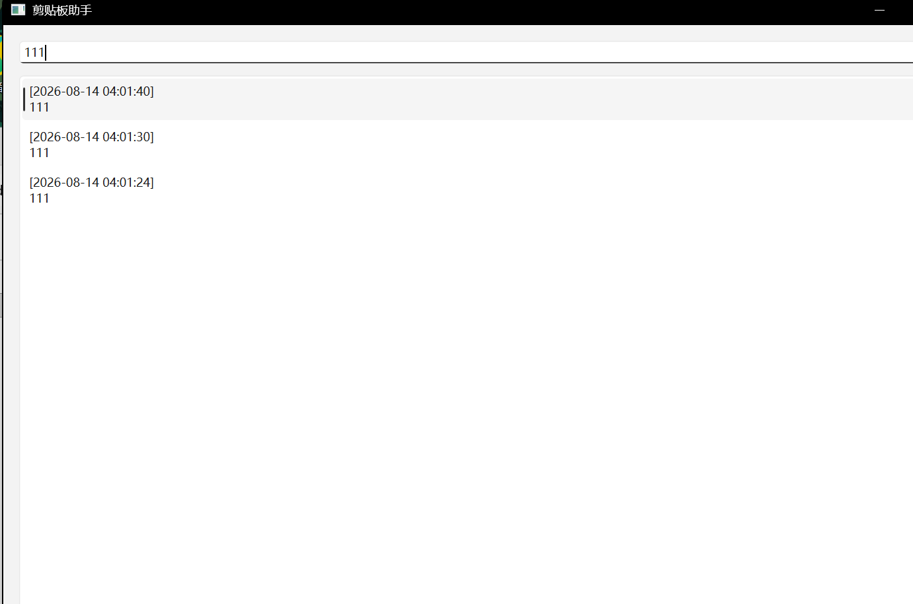

# ClipboardAssistant 剪贴板助手

一款基于 Python + PyQt6 开发的 Windows 平台剪贴板历史管理小工具。程序常驻系统托盘，在本地保存文本剪贴板历史，并支持搜索、复制、删除、导出和设置。

## 功能

1. 实时全局监听系统剪贴板，自动保存其他应用程序复制的文本内容
2. 主窗口关闭后最小化到系统托盘后台常驻，右键菜单可彻底退出程序
3. 支持关键词搜索、清空全部记录和导出为 TXT 文档
4. 双击历史条目可快速重新复制原始文本到剪贴板
5. 右键历史条目可删除单条记录
6. 最新记录始终显示在列表最上方，并自动过滤短时间内的重复通知
7. 支持设置最大记录数、相同内容去重时间、开机自动启动、启动后显示窗口和自定义托盘图标
8. 单实例保护，避免重复启动产生多个监听器
9. 数据全部存储在本地 SQLite 数据库，无网络上传，隐私可控

## 界面预览



## 环境依赖

- Windows 10 或更高版本
- Python 3.11 或更高版本

安装依赖：

```powershell
python -m pip install -r requirements.txt
```

## 运行程序

在项目目录中执行：

```powershell
python main.py
```

关闭主窗口后，程序会继续在系统托盘中运行。可通过托盘菜单重新打开窗口或彻底退出程序。

## 打包 EXE

安装 PyInstaller 后执行：

```powershell
python -m pip install pyinstaller
python -m PyInstaller --noconfirm --clean --onefile --windowed --name "ClipboardAssistant" --icon "1.ico" --add-data "1.ico;." main.py
```

生成的可执行文件位于 `dist/` 目录。

## 数据与隐私

剪贴板历史和设置保存在本机：

```text
%LOCALAPPDATA%\ClipboardAssistant\
```

程序只保存文本剪贴板内容。剪贴板历史可能包含密码、访问令牌或私密消息，因此本地数据库已通过 `.gitignore` 排除，不会提交到 Git 仓库。

建议避免复制密码、访问令牌等敏感信息；如有误存，可在主窗口中右键删除单条记录，或使用“清空全部记录”删除全部历史。

## 项目结构

```text
core/   剪贴板监听和应用设置
db/     SQLite 历史记录存储
ui/     主窗口、设置窗口和托盘图标
main.py 程序入口
```
